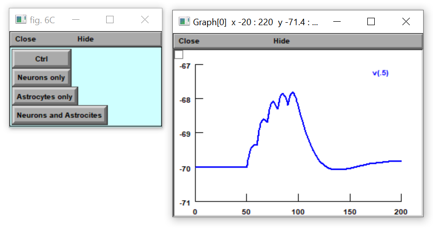

# Model Files in the NEURON Simulation Environment (v8.0)

## Paper Reference
**"Circadian modulation of neurons and astrocytes controls synaptic plasticity in hippocampal area CA1"**  
by John P. McCauley, Maurice A. Petroccione, Lianna Y. D’Brant, Gabrielle C. Todd, Nurat Affinnih, Justin J. Wisnoski, Shergil Zahid, Swasti Shree, Alioscka A. Sousa, Rose M. De Guzman, Rosanna Migliore, Alexey Brazhe, Richard D. Leapman, Alexander Khmaladze, Alexey Semyanov, Damian G. Zuloaga, Michele Migliore, and Annalisa Scimemi.  
Published in *Cell Reports, 2020*.

---

## Usage Instructions

Auto-launch from ModelDB or
alternatively, follow these steps:

1. **Compile the mod files**:
   - For Windows or graphical macOS: Use `mknrndll`.
   - For Unix/Linux: Use `nrnivmodl`.

2. **Start the simulation**:
   - On Unix/Linux, type the following command in the terminal:
     ```bash
     nrngui mosinit.hoc
     ```
   - On macOS, drag and drop the `mosinit.hoc` file onto the `nrngui` icon.
   - On Windows, double-click the `mosinit.hoc` file.

---

## Simulation Details
After selecting the option corresponding to the modulation of the NMDA and AMPA receptor properties, the simulation will reproduce the temporal summation of composite glutamatergic EPSPs at a stimulation frequency of 10 Hz (as shown in Fig. 6C of the paper).

### Example
Clicking on **"Astrocytes only"** in the initial window should produce the following graph:



---

## Questions
For questions on how to use this model, contact:  
**Rosanna Migliore** at [rosanna.migliore@cnr.it](mailto:rosanna.migliore@cnr.it)

---

## Additional Resources
- **Morphology Data**: Uploaded to the [neuromorpho.org database](http://www.neuromorpho.org).
- **Interactive Live Paper**: Available on the Brain Simulation Platform of the Human Brain Project.  
  [https://humanbrainproject.github.io/hbp-bsp-live-papers/index.htm](https://humanbrainproject.github.io/hbp-bsp-live-papers/index.htm)  
  *Note*: Access requires free user registration at [Human Brain Project](https://www.humanbrainproject.eu/en/hbp-platforms/getting-access/).

- **Datasets**: All datasets generated and/or analyzed during the study are available on Open Science Framework:  
  [https://bit.ly/3jsJXrO](https://bit.ly/3jsJXrO)

## Changelog
2025-05-25 Reformatted readme to markdown.